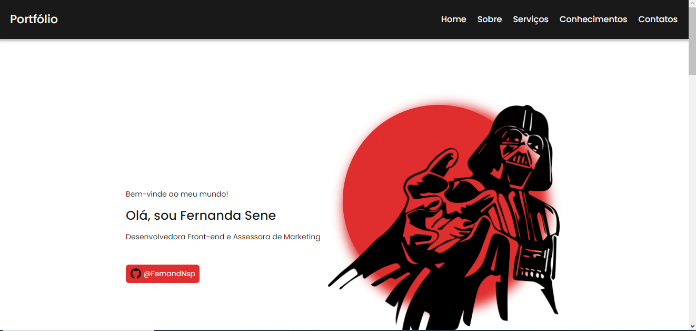
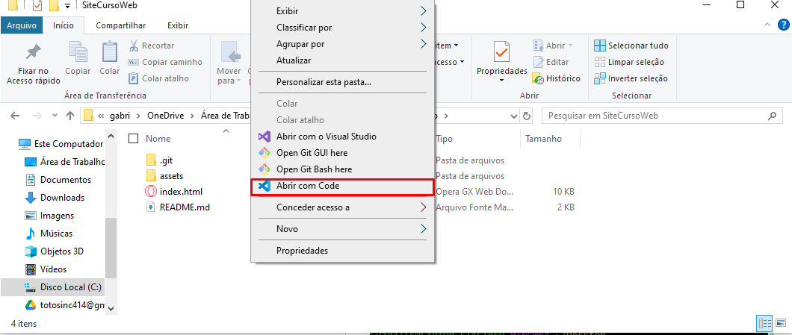

<h1 align="center">Site de portifólio byron.solutions</h1>

Este repositório contém um site de portifólio feito durante o curso de web básico da empresa júnior byron.solutions

---



---

<section id="indice">
<h2>📖 Índice</h2>
    
- <h3><a href="#status">Status</a><h3>
- <h3><a href="#features">Features</a><h3>
- <h3><a href="#aplicacao">Aplicação</a><h3>

- <h3><a href="#instalacao">Instalação</a><h3>
- <h3><a href="#tecnologias">Tecnologias</a><h3>
- <h3><a href="#contribucao">Contribuição</a><h3>
- <h3><a href="#autor">Autor</a><h3>
  </section>

<section id="status">

<h2>✅ Status do Projeto</h2>

<h3>✔ Projeto Concluído</h3>

</section>

<section id="features">
<h2>💻 Features</h2>

- [x] Seção Home
- [x] Seção Sobre
- [x] Seção Conhecimentos
- [x] Seção Serviços
- [x] Seção Contatos
- [x] Animações

</section>

<section id="aplicacao">

<h2>👀 Demonstração do Projeto</h2>

<h3>🖥 Desktop</h3>


<h3>📱 Mobile</h3>


</section>

<section id="instalacao">

<h2>⬇ Download e Instalação</h2>

<h3>Pré-requisitos</h3>

Antes de poder realizar a instalação do projeto, é necessário instalar o [Git](https://git-scm.com) e um editor de código de sua preferência - minha recomendação é o [Visual Studio Code](https://code.visualstudio.com). Ambos são amplamente utilizados e documentados, sendo fácil encrontrar informações sobre sua instalação e uso.

<h3>Instalação</h3>

Para realizar a instalação do projeto em seu ambiente é necessário escolher um diretório e abri-lo no VSCode.



Em seguida, será necessário abrir o terminal do code com o atalho Ctrl+J. Nele basta digitar os seguintes códigos:

```
git init

git clone https://github.com/G-Toti/Landing-Page.git
```

Dessa forma, o projeto estará disponível em seu ambiente para a edição e uso, basta executar o arquivo `index.html` para utilizá-lo.

Caso haja interesse na edição do arquivo, com a intenção de melhorar sua experiência, recomeda-se o uso das extensões `Live Server` - que possibilitará a atualização automática na página ao salvar as alterações - e a `HTML CSS Support` para facilitar as alterações no código.

<section>

<section id="tecnologias">

<h2>🚀 Tecnologias Utilizadas</h2>


</section>

<section id="contribucao">
<h2>🤝 Contribuição</h2>

<a href="https://www.byronsolutions.com" target="_blank">

</a>

</section>

<section id="autor">

<h2>👨‍🎨 Autor</h2>

<table>
  <tbody>
    <tr>
      <td align="center">
        <a href="https://github.com/G-Toti">
          
          <h3>Gabriel Toti</h3>
        </a>
      </td> 
    </tr>
  </tbody>
</table>

</section>
